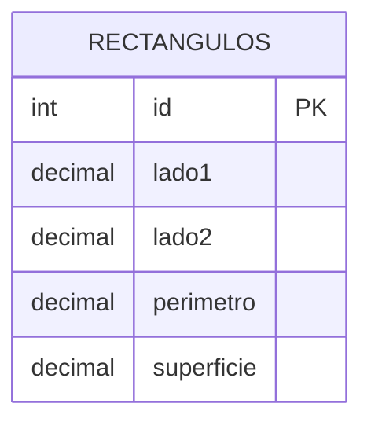

# Diagrama entidad-relación - Ejercicio 1

```mermaid
erDiagram
    RECTANGULOS {
        int id PK
        decimal lado1
        decimal lado2
        decimal perimetro
        decimal superficie
    }
```