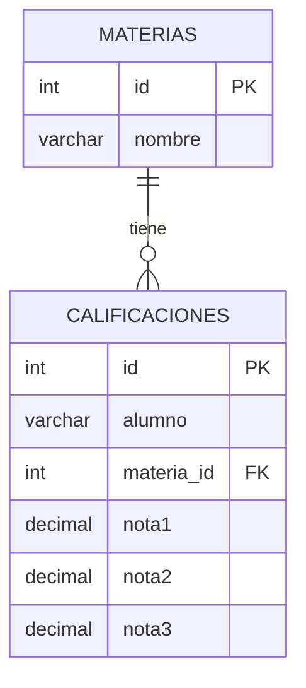

# Diagrama entidad-relación - Ejercicio 3

```mermaid
erDiagram
    MATERIAS ||--o{ CALIFICACIONES : "tiene"
    MATERIAS {
        int id PK
        varchar nombre
    }
    CALIFICACIONES {
        int id PK
        varchar alumno
        int materia_id FK
        decimal nota1
        decimal nota2
        decimal nota3
    }
```